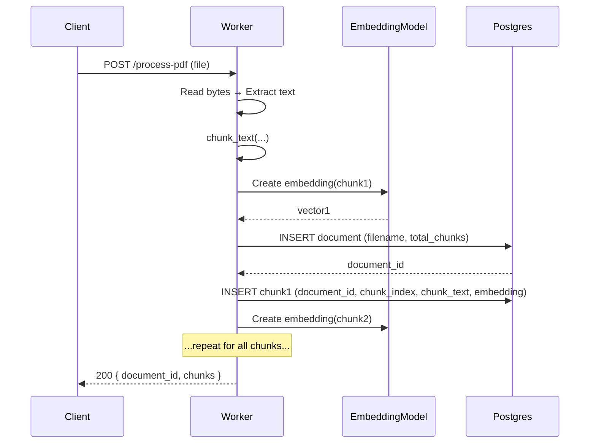

# Low-level sequence (PDF ingestion)



## Low-Level Architecture

```txt
User Query
   │
   ▼
NestJS API
   │ 1. Validate query
   │ 2. Send query → worker (/search)
   ▼
Python Worker
   │ 1. Embed query locally
   │ 2. Vector similarity search (cosine)
   │ 3. Return top chunks
   ▼
NestJS API
   │ 3. Format chunks
   │ 4. Call Groq LLM to generate answer
   ▼
LLM Answer
   │
   ▼
UI (Final Response)
```
